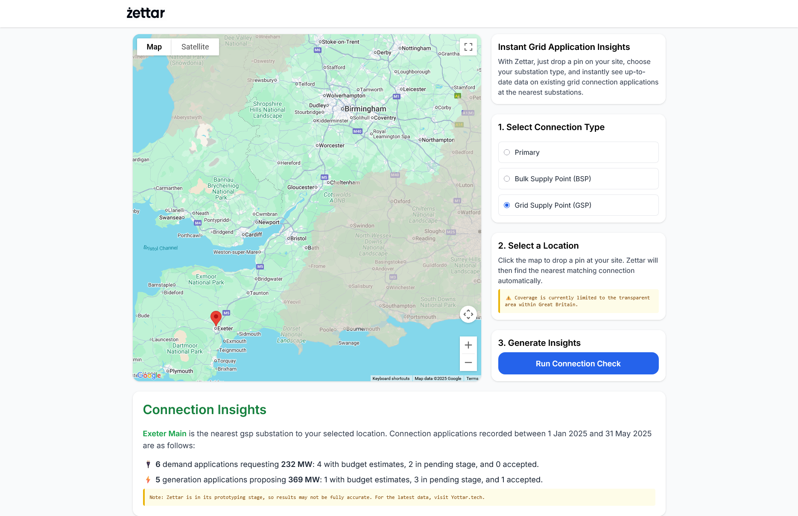

<table style="margin: 0 auto; text-align: center; border: 1px solid #ccc;">
  <tr>
    <td align=center>
      
    </td>
  </tr>
</table>

  Zettar helps developers find viable grid connection points by turning messy DNO data into clean insights using geospatial technology and up-to-date application data.

## 📷 Interface Preview  

  

## 📘 Product Overview
Zettar is a platform that helps developers identify feasible Points of Connection (POCs) for new site projects - such as factories, renewable energy installations, or EV charging hubs - to the National Grid of Great Britain. It focuses specifically on analysing other applications at each connection point, cleaning and structuring raw, inconsistent DNO data into a standardised, easy‑to‑interpret format, making it instantly valuable for site selection.

DNO application datasets are often released in messy, inconsistent formats, making it hard to understand current capacity or demand, or gauge how many projects are already in the queue. Zettar transforms this data into a clean, searchable, map‑based tool - giving developers a clear view of grid availability and enabling faster, smarter siting decisions.

### Features

- **Location & Connection Search:** Drop a pin and choose a connection type (Primary, BSP, or GSP) to find the nearest relevant substation.  
- **Interactive Mapping:** Powered by the Google Maps API, the map-based UI makes it easy to explore potential sites visually.  
- **Up-to-date DNO Data:** Displays generation and demand application data for substations including capacity, number of applicants, and application status.

## 💻 Technology

###  Tech Stack
- **Backend:** Python, Django  
- **Frontend:** Alpine.js, Tailwind CSS  
- **Database:** PostgreSQL with PostGIS extension  
- **Data Sources:** National Grid DNO dataset (additional DNOs planned)  
- **APIs:** Google Maps  
- **Deployment:** Dockerised environment hosted on Render.com

### Geospatial Intelligence

- **PostGIS (PostgreSQL extension)**: powers spatial queries to determine proximity - e.g., locating the nearest substations to any given point - and supports spatial joins, geometry operations, and more
- **GeoDjango**: Django's geographic framework extends the ORM with support for spatial data type to enable direct storage and manipulation of geospatial data in Django models. GeoDjango integrates with libraries such as GEOS and GDAL, as well as the PostGIS Postgres extension, to enable geospatial data handling
- **Google Maps API Integration**: Delivers an intuitive, interactive visualisation layer for all spatial data, allowing users to explore infrastructure and network elements in real-world context

## 📊 Data 

### Wrangling & Processing

Zettar’s Django backend provides a set of custom management commands that can be run to:
1. Ingest raw, messy DNO datasets.  
2. Standardise naming conventions, formats, and units.  
3. Transform inconsistent source data into a clean, structured, user‑friendly format, and return to the user where required. 

###  Sources

There are 14 electricity distribution licence areas across Great Britain, operated by six groups: UK Power Networks, National Grid Electricity Distribution, SP Energy Networks, Northern Powergrid, Electricity North West, and Scottish and Southern Electricity Networks.

  

  Each group publishes substation geolocation and application data independently. The links below reference the datasets currently used in this project. So far only National Grid data has been processed and integrated, with support for additional DNOs planned.

| Name | Description | Link |
| :---: | :---: | :---: |
| Primary Substation Locations (NGID) | Geographic locations of primary substations managed by National Grid DNOs | [View](https://connecteddata.nationalgrid.co.uk/dataset/primary-substation-location-easting-northings) |
| New Connections (NGID) | Dataset of new connection applications to National Grid DNOs | [View](https://connecteddata.nationalgrid.co.uk/dataset/new-connections)  |

###  Dataset Quality Commentary

The data is inconsistently provided in various formats, requiring separate cleaning for each dataset. Some are more accessible than others, but are easy to integrate without prior cleaning. Below is a summary of my thoughts on the accessibility of each dataset.

| DNO | Substation Geolocation Data Quality | Substation Application Data Quality |
| :---: | :---: | :---: |
| UK Power Networks |  Medium | Medium |
| National Grid Electricity Distribution | Medium | Medium |
| SP Energy Networks | Low | Low |
| Northern Powergrid | High | High |
| Electricity North West | High | Medium |
| Scottish and Southern Electricity Networks | Low | Low |

An illustrative case study with NGID revealed the inconsistent ways substations were labeled in the dataset. Rather than using a dedicated column for substation type, the type was often embedded within the name itself, leading to inconsistent formatting - examples include "Primary Substation", "S/S", "S/Stn", "Power Station", "Primary", and "S Stn.". Similarly, voltage values were inconsistently presented as "kv", "kV", "Kv", or "KV". While many of these variations didn’t directly affect data accuracy, some entries were so unstructured that informed assumptions had to be made during cleaning and processing.

## 🧭 Roadmap

- **Full DNO Coverage**: Currently, Zettar only integrates data from the National Grid DNO. The goal is to expand coverage across all six DNO groups in Great Britain. Each dataset is published in a different format, so this expansion will require tailored data cleaning for each group
- **Demand Side Integration**: At present, Zettar focuses on formal generation and demand applications at substations. However, incorporating informal demand indicators - such as developer interest tracked within Zettar - could enhance site selection insights. This would need to be implemented carefully to avoid creating a self-fulfilling feedback loop.
- **Get more informative description of DNO data**: Beyond inconsistent formatting, raw DNO datasets often lack clear or useful descriptions. Key information is missing or ambiguous, leading to assumptions during processing. Incorporating clarification requests directly into Zettar could make the tool more self-sufficient - helping users understand the data without needing to contact DNOs themselves, which can be time-consuming.