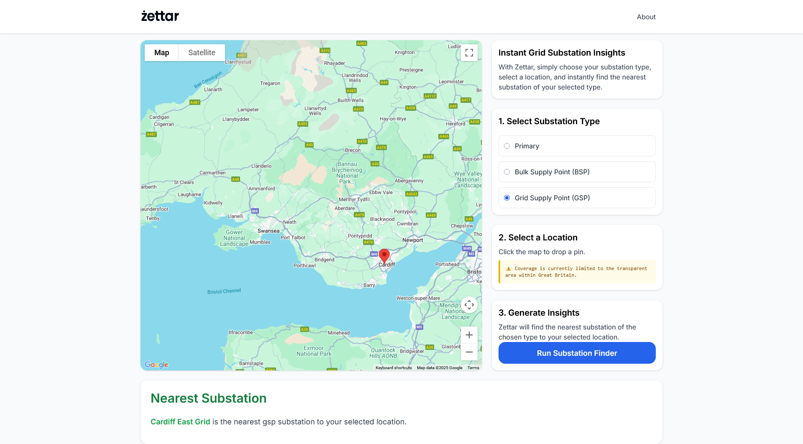
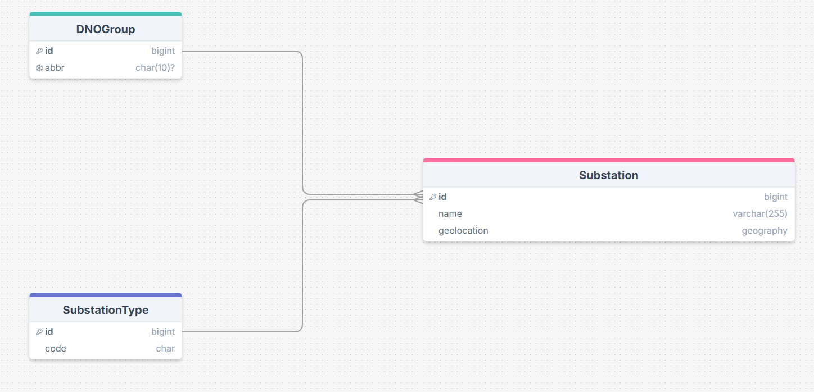

  <table style="margin: 0 auto; border: 1px solid #ccc;">
    <tr>
      <td align=center>
        
      </td>
    </tr>
  </table>

  Zettar helps individuals find their nearest electrical substation by turning messy DNO data into clean insights using geospatial technology. Available at <a href="https://www.zettar.tech" target="_blank">www.zettar.tech</a>.

## 📷 Interface Preview  

  

## 📘 Product Overview
Zettar is a platform that helps users locate the nearest electrical substation by type. By entering a location and selecting a substation category (Primary, BSP, or GSP), users receive the closest matching substation.

Substation location data from Distribution Network Operators (DNOs) is often messy and inconsistently formatted, making it difficult to identify nearby connection points. Zettar cleans and standardises this data into a searchable, map-based tool - offering a clear, reliable view of the grid’s infrastructure.

### Features

- **Location & Connection Search:** Drop a pin and choose a connection type (Primary, BSP, or GSP) to find the nearest relevant substation
- **Interactive Mapping:** Powered by the Google Maps API, the map-based UI makes it easy to explore potential sites visually  
- **Up-to-date DNO Data:** Retrieves the latest substation location data directly from DNO-provided sources, ensuring results reflect the most current network information

## 💻 Technology

###  Tech Stack
- **Backend:** Python, Django  
- **Frontend:** Alpine.js, Tailwind CSS  
- **Database:** PostgreSQL (PostGIS)  
- **APIs:** Google Maps, OpenDataSoft (Northen Powergrid and UK Power Networks datasets), CKAN (National Grid datasets)    
- **Deployment:** Dockerised environment hosted on Render.com

### Geospatial Intelligence

- **PostGIS (PostgreSQL extension)**: powers spatial queries to determine proximity - e.g., locating the nearest substations to any given point - and supports spatial joins, geometry operations, and more
- **GeoDjango**: Django's geographic framework extends the ORM with support for spatial data type to enable direct storage and manipulation of geospatial data in Django models. GeoDjango integrates with libraries such as GEOS and GDAL, as well as the PostGIS Postgres extension, to enable geospatial data handling
- **Google Maps API Integration**: Delivers an intuitive, interactive visualisation layer for all spatial data, allowing users to explore infrastructure and network elements in real-world context

## 📊 Data 

### Wrangling & Processing

Zettar’s Django backend includes a custom data pipeline, implemented through management commands that:
1. Ingest raw, messy DNO datasets.  
2. Standardise naming conventions, formats, and units.  
3. Transform inconsistent source data into a clean, structured, user‑friendly format, and return to the user where required. 

###  Sources

There are 14 electricity distribution licence areas across Great Britain, operated by six groups: UK Power Networks, National Grid Electricity Distribution, SP Energy Networks, Northern Powergrid, Electricity North West, and Scottish and Southern Electricity Networks.

  

  Each group publishes substation geolocation independently. The links below reference the datasets currently used in this project.

| DNO Group | Title | Substation Geolocation Data Extracted | Source Link |
| :---: | :---: | :---: | :---: |
| NGED | Primary Substation Location (Easting / Northings) | Primary, BSP, GSP | [View](https://connecteddata.nationalgrid.co.uk/dataset/primary-substation-location-easting-northings) |
| NP | Substation Sites List | Primary, BSP| [View](https://northernpowergrid.opendatasoft.com/explore/dataset/substation_sites_list/table/?disjunctive.site_purpose&disjunctive.dno_area&sort=-site_purpose) |
| NP | Northern Powergrid DFES GSP - Portal Format | GSP | [View](https://northernpowergrid.opendatasoft.com/explore/dataset/northern-powergrid-dfes-gsp-portalformat/information/?disjunctive.licence_area&disjunctive.scenario_name&disjunctive.voltage_level&disjunctive.substation&disjunctive.year&sort=substation) |
UKPN | UK Power Networks Grid and Primary Sites | Primary, BSP | [View](https://ukpowernetworks.opendatasoft.com/explore/dataset/grid-and-primary-sites/information/?disjunctive.local_authority&disjunctive.powertransformercount) |
UKPN | Grid Supply Points Overview | GSP | [View](https://ukpowernetworks.opendatasoft.com/explore/dataset/ukpn-grid-supply-points-overview/table/) |

###  Schema Diagram

  

###  Dataset Quality Commentary

The data is published in a variety of inconsistent formats, requiring tailored cleaning for each dataset. While some sources were more accessible than others, none could be integrated without substantial preprocessing.

A case study using NGED data highlighted the challenges: substation types were not stored in a dedicated column but embedded within the name field using inconsistent and informal labels—such as "Primary Substation", "S/S", "S/Stn", "Power Station", "Primary", and "S Stn."—making standardisation non-trivial.

## 🔍 Retrospective

The main takeaway was just how inconsistent and poorly structured the source datasets were. The data tended to be messy, without standard formatting, and even requiring informed assumptions to be usable. Each DNO published their data differently, meaning a separate ingestion and cleaning pipeline was needed for each one.

Key takeaway: even modest datasets can lead to significant engineering effort when sourced from unstandardised, manually maintained public data.

## 🧭 Product Roadmap

The next step is to expand Zettar’s coverage to include a broader range of energy-related datasets. While there is a wealth of valuable data available, much of it remains fragmented and inconsistently formatted across different DNOs. The goal is to gradually integrate these sources into a unified, structured platform - transforming what is currently a scattered and messy landscape into a coherent and accessible view of the UK’s energy data.